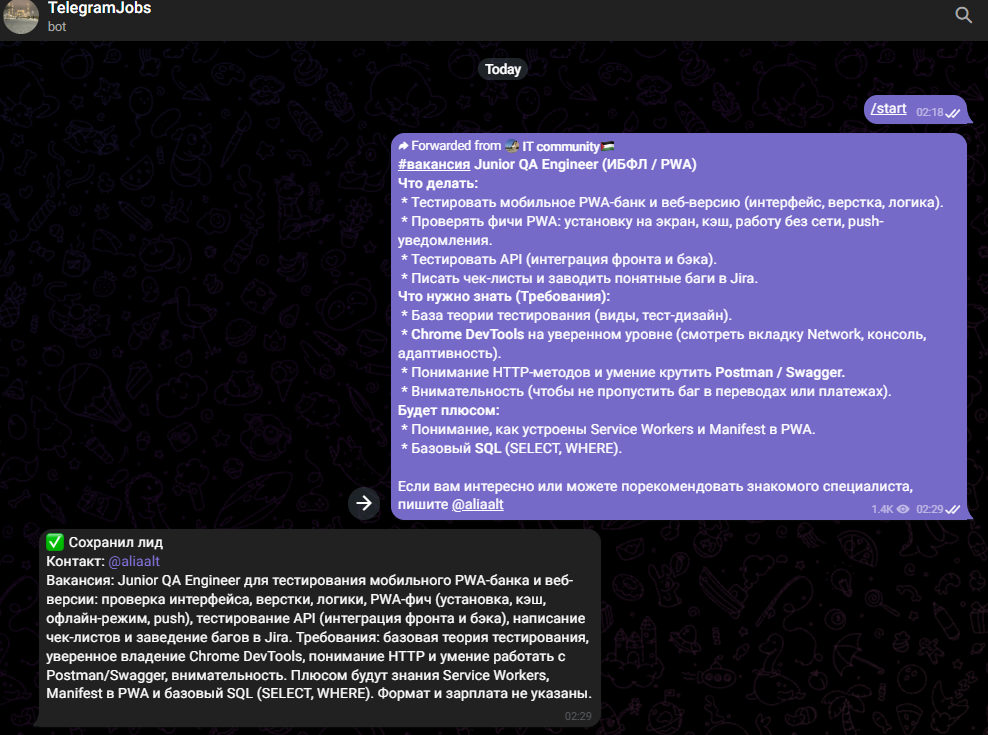
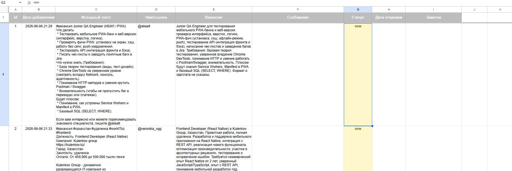
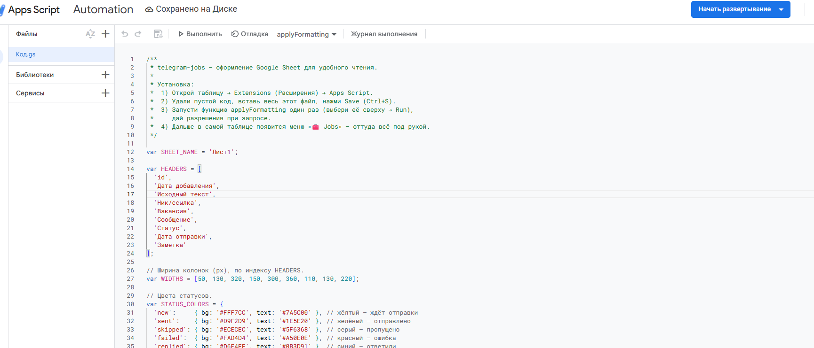

# telegram-jobs

**Личный помощник для отклика на IT-вакансии в Telegram.** Превращает рутину «найти
контакт HR → написать персональное сообщение → приложить резюме → не забыть, кому уже
отправил» в пару простых действий.

Как это работает на практике:

- **В течение недели.** Увидел подходящую вакансию — просто перешли её текст своему боту
  с телефона. Бот через OpenAI сам находит контакт HR (`@ник` или ссылку), кратко
  структурирует вакансию и сохраняет всё как «лид» в Google-таблицу со статусом `new`.
- **В конце недели.** На ноутбуке одной командой запускаешь рассылку. Для каждого лида
  она генерирует персональное сообщение на основе твоего резюме и текста вакансии,
  показывает его тебе на подтверждение (можно отредактировать), и отправляет HR
  **от твоего имени** с приложенным PDF-резюме. Статус лида становится `sent`.

Все вакансии собраны в одной таблице: видно, что уже отправлено, а что ещё в очереди —
ничего не теряется и не забывается.

```
Телефон → текст вакансии → [бот на Vercel + OpenAI] → Google-таблица (статус: new)
Конец недели → [рассылка на ноуте, Telethon] → читает таблицу → ты подтверждаешь → отправка → статус: sent
```

Вот так выглядит, когда ты переслал боту вакансию, а он распарсил контакт и сохранил лид:



Проект состоит из двух частей:

| Папка | Что это | Где работает |
|---|---|---|
| `intake-bot/` | Telegram-бот-приёмник: принимает вакансии, достаёт контакт через OpenAI, пишет лид в таблицу | Облако (Vercel), 24/7 |
| `sender/` | Локальная рассылка: генерит сообщение по CV, отправляет от твоего аккаунта | Твой ноутбук |

---

> [!CAUTION]
> ## Риск бана аккаунта — прочитай обязательно
> Рассылка идёт через **твой личный Telegram-аккаунт** (userbot). Массовые сообщения
> незнакомым людям **нарушают правила Telegram**, и аккаунт могут **заблокировать**.
>
> **Настоятельно рекомендуется завести ОТДЕЛЬНЫЙ номер** (новая SIM стоит недорого) и
> использовать для рассылки именно его, а не свой основной аккаунт. Тогда в случае бана
> ты не потеряешь личный аккаунт с перепиской.
>
> Чтобы снизить риск:
> - не убирай случайные паузы между отправками (`MIN/MAX_DELAY_SECONDS`);
> - не отправляй всю очередь за один заход — разбивай на несколько дней;
> - запускай рассылку **с домашнего IP** (не из облака/VPS);
> - подтверждай каждое сообщение вручную, не шли всё подряд.

> [!IMPORTANT]
> Все ключи и токены, которые ты куда-то вставляешь, держи **только** в `.env` и
> `service_account.json`. Эти файлы в `.gitignore` и **никогда не коммитятся**. Если
> случайно засветил секрет — сразу его перевыпусти (rotate).

---

## Что понадобится

- **Python 3.10+** (`python --version`).
- **Telegram-аккаунт** для рассылки (лучше на отдельном номере, см. предупреждение выше).
- **Ключ OpenAI API.**
- **Google-аккаунт** (для таблицы и сервис-аккаунта).
- Для облачного бота: аккаунты **GitHub** и **Vercel** (бесплатно).

---

## Шаг 1. Склонировать проект

```powershell
git clone https://github.com/Bolatbekermekov/telegram-jobs.git
cd telegram-jobs
```

---

## Шаг 2. Google-таблица и доступ к ней

**2.1. Создай таблицу.** Зайди на [sheets.new](https://sheets.new). Из адреса скопируй
`SHEET_ID` — это часть URL между `/d/` и `/edit`:
```
https://docs.google.com/spreadsheets/d/ЭТО_И_ЕСТЬ_SHEET_ID/edit
```
Запомни также имя вкладки внизу (по умолчанию `Лист1`) — это `SHEET_TAB`.
Заголовки колонок создавать вручную **не нужно** — бот сам их проставит при первом лиде.
Вот как таблица выглядит с накопленными лидами:



**2.2. Создай сервис-аккаунт Google** (робот, от имени которого код пишет в таблицу):
1. Открой [Google Cloud Console](https://console.cloud.google.com/) → создай проект.
2. В поиске найди и включи **Google Sheets API** (APIs & Services → Enable).
3. APIs & Services → **Credentials** → Create credentials → **Service account** → создай.
4. Открой созданный сервис-аккаунт → вкладка **Keys** → Add key → **Create new key** →
   тип **JSON** → скачается файл.
5. Переименуй его в **`service_account.json`** и положи в **корень проекта** (рядом с этим
   README). Файл в `.gitignore`, в репозиторий не попадёт — у каждого свой.

**2.3. Дай сервис-аккаунту доступ к таблице (без этого ничего не заработает).**
Открой `service_account.json`, найди поле `client_email` (вид
`...@...iam.gserviceaccount.com`). Скопируй его. В таблице нажми **Поделиться** и добавь
этот email с правом **Редактор**.

> [!NOTE]
> Сервис-аккаунт в API — это только «личность» робота. Право писать в КОНКРЕТНУЮ таблицу
> даётся отдельно, через «Поделиться». Если пропустить — будет ошибка доступа `403`.

**2.4. (необязательно) Красивое оформление таблицы.** В таблице: Расширения → Apps Script,
вставь содержимое `google-apps-script/Formatting.gs`, сохрани и запусти `applyFormatting`.
Появятся цветные статусы (`new` — жёлтый, `sent` — зелёный и т.д.) и удобное форматирование.



---

## Шаг 3. Получить ключи и токены

**3.1. OpenAI API key** — [platform.openai.com/api-keys](https://platform.openai.com/api-keys)
→ Create new secret key. Это `OPENAI_API_KEY`.

**3.2. Токен бота-приёмника** — в Telegram напиши [@BotFather](https://t.me/BotFather):
`/newbot` → задай имя и @username бота → он пришлёт **токен** вида `123456:AA...`.
Это `TELEGRAM_BOT_TOKEN`. Этим ботом ты будешь кидать вакансии.

**3.3. api_id и api_hash для рассылки** — зайди на
[my.telegram.org](https://my.telegram.org) под номером аккаунта-**отправителя** → API
development tools → создай приложение. Получишь `TELEGRAM_API_ID` (число) и
`TELEGRAM_API_HASH` (строка).

---

## Шаг 4. Заполнить `.env`

Скопируй пример и открой в редакторе:
```powershell
copy .env.example .env
```
Заполни значения (в `.env.example` каждая переменная подробно описана):

| Переменная | Что это |
|---|---|
| `OPENAI_API_KEY` | Ключ OpenAI (шаг 3.1) |
| `OPENAI_MODEL` | Модель для писем HR, напр. `gpt-5.4-mini` |
| `OPENAI_MODEL_CHEAP` | Дешёвая модель для оценки вакансий и саммари, напр. `gpt-5.4-nano` |
| `TELEGRAM_BOT_TOKEN` | Токен бота-приёмника (шаг 3.2) |
| `TELEGRAM_API_ID` / `TELEGRAM_API_HASH` | Данные аккаунта-отправителя (шаг 3.3) |
| `GOOGLE_SERVICE_ACCOUNT_FILE` | Путь к ключу, обычно `./service_account.json` |
| `SHEET_ID` / `SHEET_TAB` | ID таблицы и имя вкладки (шаг 2.1) |
| `CV_PATH` | Можно оставить **пустым** — резюме берётся из `sender/cv/` (шаг 5) |
| `MIN_DELAY_SECONDS` / `MAX_DELAY_SECONDS` | Случайная пауза между отправками (анти-бан) |
| `ATTACH_CV` | `true` — прикладывать PDF резюме к сообщению |
| `AUTO_SEND` | `false` — спрашивать по каждому лиду; `true` — слать всё автоматически (см. Шаг 9) |
| `PAUSED_PLATFORMS` | Площадки, которые не трогают ни отправка, ни поиск: `linkedin,hh`. Их лиды остаются `new` и ждут снятия паузы, а `make search` и воркер такую площадку не ищут |
| `HH_WORK_FORMAT` | Формат работы на hh: `REMOTE` (по умолчанию), `HYBRID`, `ON_SITE`, `FIELD_WORK`; несколько через запятую, пусто = любой |
| `HH_AREAS` | Регион на hh числовым id: `40`=Казахстан, `159`=Астана, `1`=Москва, `113`=Россия; несколько через запятую. Пусто (по умолчанию) = без фильтра региона |
| `HH_EXPERIENCE` | Требуемый опыт на hh: `noExperience`, `between1And3`, `between3And6`, `moreThan6`. Пусто (по умолчанию) = любой, уровень отсеивает ИИ-скоринг |
| `HH_SEARCH_PERIOD` | Окно публикации на hh в днях: `1`, `3`, `7` (по умолчанию), `30`; `0` = за всё время |
| `HH_ORDER_BY` | Сортировка выдачи hh: пусто (по умолчанию) = по релевантности, `publication_time` = по дате |
| `HH_PAGES` | Сколько страниц выдачи hh проходить по каждому слову (по 50 карточек). По умолчанию `2` |
| `REMOCATE_PAGES` | Сколько страниц ленты Remocate проходить (по 20 вакансий; в разделе их 102). По умолчанию `3` — дальше лента мёртвая: замер 2026-08-27 дал 15% мёртвых вакансий на 1-й странице, 25% на 3-й и уже 75% на 10-й |

---

## Шаг 5. Резюме, подпись и промпт

**5.1. Резюме.** Положи свой файл резюме (PDF или txt) в папку **`sender/cv/`**.
Рассылка сама его подхватит. Папка в `.gitignore` — твоё CV в репозиторий не попадёт.

**5.2. Подпись с контактами.** Скопируй пример и впиши свои контакты:
```powershell
copy sender\signature.txt.example sender\signature.txt
```
Внутри укажи Telegram, email, **LinkedIn**, телефон. Этот блок дописывается к **каждому**
сообщению как подпись (кодом, а не ИИ — поэтому ссылки всегда корректные). Файл в
`.gitignore`. LinkedIn прикрепляется **ссылкой в подписи**, не файлом.

**5.2a. Анкета для форм отклика.** Отклик на вакансии с внешних сайтов (Workday, Greenhouse,
join.com и т.п.) заполняет форму за тебя, и данные для неё берутся из **`sender/apply_profile.yml`**:
```powershell
copy sender\apply_profile.example.yml sender\apply_profile.yml
```
Минимум — имя и email; остальное по желанию. Файл в `.gitignore`.

> [!IMPORTANT]
> Пока файла нет, автоотклик **не выключается, а работает вхолостую**: профиль грузится
> пустым, любая открывшаяся форма упирается в незаполненные обязательные поля, и лид
> уходит в `manual` с пометкой вида «не заполнены обязательные поля ['First Name',
> 'Email']». Выглядит как причуда конкретного сайта, но причина одна на всех. `make run`
> теперь предупреждает об этом на старте. Если внешние отклики не нужны —
> `EXTERNAL_APPLY_ENABLED=false` в `.env`.

**5.3. Промпт (как тебя «продаёт» сообщение).** Это файл **`sender/profile.md`** — открой
и подстрой под себя: кто ты, как позиционировать под роли (разработка / QA), тон, стиль.
Системные жёсткие правила (без тире, без указания уровня, формат) лежат в
`sender/app/infrastructure/openai_client.py`. Для большинства правок хватает `profile.md`.

---

## Шаг 6. Установить зависимости (один раз)

```powershell
cd sender
python -m venv .venv
.\.venv\Scripts\pip.exe install -r requirements.txt
cd ..
```
Активировать venv каждый раз **не обязательно** — команды `make` ниже сами используют
`sender/.venv/Scripts/python.exe`.

---

## Шаг 7. Войти в Telegram по QR-коду

```powershell
make login_telegram
```
1. В терминале появится **QR-код**.
2. На телефоне открой Telegram **под аккаунтом-отправителем** (тем самым номером из шага 3.3).
3. Настройки → **Устройства** → **Подключить устройство** → наведи камеру на QR в терминале.
4. Увидишь `✅ Вход выполнен как …` — создастся файл сессии, больше входить не нужно.

> [!TIP]
> Вход именно по QR, потому что код подтверждения Telegram часто приходит **внутрь
> приложения** (в чат «Telegram»), а не по SMS, и его легко не найти. QR это обходит.
> Если QR в терминале «кривой» — разверни окно на весь экран и уменьши шрифт (Ctrl+−),
> чтобы он влез целиком.

---

## Шаг 8. Проверить генерацию и отправку

**Показать сгенерированное сообщение (без отправки):**
```powershell
make dry
```

**Отправить тестовое сообщение самому себе** (получатель задан в `Makefile`, переменная `TO`):
```powershell
make test
```
Проверь: пришёл ли текст и приложился ли PDF. Статус лида в таблице при этом **не меняется**.

---

## Шаг 9. Реальная рассылка

```powershell
make run
```
По каждому лиду со статусом `new` бот сгенерит сообщение и спросит, что делать:

| Клавиша | Действие |
|---|---|
| `s` | Отправить (DM с резюме уходит HR, статус → `sent`) |
| `k` | Пропустить (статус → `skipped`) |
| `q` | Выйти |
| что угодно ещё | Ничего не отправляется, лид остаётся `new` |

> [!IMPORTANT]
> Отправка — **только** по `s`. Пустой Enter, опечатка, любая другая клавиша — это «не
> сейчас»: сообщение не уходит, статус не пишется, лид остаётся `new` и придёт снова в
> следующий прогон. Раньше всё нераспознанное **отправлялось**.

### Статус `invited` — приглашение без письма

У бесплатного LinkedIn около пяти **персональных** приглашений в месяц. Когда лимит
исчерпан, письмо к запросу на контакт приложить нельзя — раньше прогон на этом
останавливал всю платформу до следующего месяца.

Теперь запрос всё равно уходит, просто **без сопроводительного письма**, а лид
получает статус **`invited`**. Это не отправка: адресат получил только запрос.

**Каждый прогон начинается с проверки таких лидов** — до того, как браться за `new`,
и даже если новых лидов нет вовсе:

| что видит бот на профиле | что делает |
|---|---|
| «На рассмотрении» | ничего, ждёт дальше — лид остаётся `invited` |
| приглашение принято | пишет сопроводительное **с резюме**, статус → `sent` |
| кнопка «Установить контакт» вернулась | приглашение отклонено или истекло → `manual` |

Резюме прикладывается только здесь: приложить файл LinkedIn разрешает лишь к
сообщению уже установленному контакту, а к запросу на контакт — нет.

> [!NOTE]
> Отклонённое приглашение уходит в `manual`, а не в `new`, намеренно: слать запрос
> повторно человеку, который один раз уже отказал, — решение за тобой, а не повод
> для цикла.

> [!IMPORTANT]
> `k` — это **терминальный** статус: `skipped` лид в очередь больше не попадает никогда
> (`fetch_new_leads` читает только `new`). Поэтому лид, который надо просто **поправить**
> — не тот контакт, кривая вакансия — не пропускай: выйди по `q`, отредактируй строку в
> таблице и запусти `make run` заново.

> [!WARNING]
> Если в тексте остался `[плейсхолдер]` (например «почему именно эта компания»), программа
> предупредит — но редактора в цикле нет. Не отправляй такой текст: выйди по `q` и запусти
> прогон заново, сообщение генерится с нуля каждый раз, и в следующий заход плейсхолдера,
> скорее всего, уже не будет. Иначе HR увидит шаблон.

### Авто-режим (без подтверждения)

По умолчанию рассылка спрашивает по каждому лиду. Если хочешь, чтобы она отправляла **всё
сама**, поставь в `.env`:
```
AUTO_SEND=true
```
Тогда `make run` по каждому лиду генерирует сообщение, **сразу отправляет** его, ждёт
случайную паузу (`MIN/MAX_DELAY_SECONDS`) и идёт дальше — с теми же логами, но без вопросов
`s/k/q`. Отправляются **все** лиды со статусом `new` за один заход — ограничения по
количеству нет. Чтобы вернуть подтверждение, поставь `AUTO_SEND=false` (значение по
умолчанию).

> [!CAUTION]
> В авто-режиме ты **не вычитываешь** сообщения перед отправкой живым HR — риск ошибки и
> бана выше. Сначала прогони `make dry` на нескольких лидах и убедись, что текст хороший.
> На всякий случай авто-режим **не отправляет** сообщения, где остался `[плейсхолдер]`:
> лид остаётся `new`, и в следующий прогон текст просто сгенерится заново.
> Отдельно он **не отправляет** лид из Threads, если контакт предложила модель, а не
> правила. Из текста треда правила берут только однозначное — почту, ссылку `t.me`,
> ссылку на LinkedIn/hh/Wellfound; голое `@упоминание` контактом не считается («Спасибо
> @kollega за репост» — это не тот, кому писать), его разбирает модель. Подтверждение и
> есть проверка такого контакта, поэтому без него лид получает статус `manual`, а в
> заметку идёт причина, кому он был адресован и ссылка на тред. В очередь он больше не
> попадает: чтобы вернуть его, поставь Статус обратно в `new`.
>
> Обратная сторона: раз `@упоминание` не конкурирует, однозначная форма побеждает даже
> когда в тексте сказано, что она не та — «Пишите мне @hr_acme. Прошлый работодатель —
> hr@oldcorp.io, там уже не набирают» уйдёт на `hr@oldcorp.io`. По форме не понять, чей
> это адрес. В ручном режиме это видно перед отправкой.

---

## Шаг 10. (опционально) Облачный бот-приёмник на Vercel

Чтобы кидать вакансии с телефона в любой момент (даже когда ноут выключен), задеплой
`intake-bot/` в облако.

1. Запушь проект в **свой** GitHub-репозиторий.
2. На [vercel.com](https://vercel.com) → Add New → Project → импортируй репозиторий.
3. **Root Directory** укажи `intake-bot`.
4. В **Environment Variables** добавь: `OPENAI_API_KEY`, `OPENAI_MODEL`, `TELEGRAM_BOT_TOKEN`,
   `SHEET_ID`, `SHEET_TAB`, и **`GOOGLE_SERVICE_ACCOUNT_JSON`** — сюда вставь **всё
   содержимое** файла `service_account.json` (файл в облако не попадает, т.к. он в
   `.gitignore`).
5. Deploy. Получишь адрес вида `https://твой-проект.vercel.app/`.
6. **Привяжи webhook** (подставь свой токен и адрес):
   ```powershell
   curl "https://api.telegram.org/bot<ТОКЕН>/setWebhook?url=https://твой-проект.vercel.app/"
   ```
7. **Меню команд бота** (чтобы по `/` показывались подсказки):
   ```powershell
   $token = "<ТОКЕН>"
   $body = '{"commands":[{"command":"status","description":"Сводка по лидам"},{"command":"start","description":"Запуск и помощь"}]}'
   Invoke-RestMethod -Method Post -Uri "https://api.telegram.org/bot$token/setMyCommands" -ContentType "application/json; charset=utf-8" -Body ([System.Text.Encoding]::UTF8.GetBytes($body))
   ```
8. Готово. Кидай боту текст вакансии → он ответит `✅ Сохранил лид`. Команда `/status`
   покажет, сколько лидов `new` и сколько `sent`.
   Бот автоматически определяет платформу и цель по тексту вакансии (Telegram @ник / t.me-ссылка,
   email, ссылка LinkedIn / hh.ru / Wellfound / Threads) и заполняет колонки «Платформа» и «Источник»;
   если контакт не найден — просит прислать вакансию заново с контактом.
   Ссылка на пост Threads — валидный лид сама по себе: контакта в ней нет, но ноут дочитает
   тред перед отправкой и найдёт его (см. «Платформы» ниже).

   Если сообщение — одна голая ссылка, бот открывает её и суммирует страницу. Когда
   страница не открылась (LinkedIn и hh придушивают облачные IP), он отвечает
   `Вакансия: не прочиталась сейчас` и оставляет колонку **пустой**. Это намеренно:
   модель не умеет ходить по ссылкам, и её ответ на голый URL — «пришлите текст
   объявления» — раньше сохранялся как текст вакансии и становился основой письма.
   `make run` перечитает ссылку сам, уже без облачного таймаута, и запишет вакансию
   в таблицу перед генерацией. Если и там не прочиталось — лид остаётся `new` до
   следующего прогона, письмо не генерится.

   **Ссылка на пост LinkedIn** (`/posts/…`, `/feed/update/…`) читается всегда, а не
   только когда сообщение — голая ссылка: можно переслать её со своим текстом
   («посмотри, вроде под тебя»), и бот всё равно откроет пост. Твои слова не
   теряются — они идут в суммаризацию вместе с текстом поста, потому что пересылающий
   часто знает то, чего в объявлении нет.

   Из тела поста бот берёт **контакт для отклика**, в таком порядке: телеграм (`@ник`
   или ссылка `t.me`) → email → автор поста. Если пост говорит «резюме в телеграм
   @acme_hr», лид сохраняется как `Платформа: telegram`, `Источник: @acme_hr`, и ноут
   отправит его телеграмом, а не приглашением в LinkedIn — у бесплатного LinkedIn
   написать не-контакту первой линии всё равно нельзя. Если контакта в посте нет,
   «Источник» становится профилем автора поста, и дальше всё как обычно.
   Причина всегда пишется в «Заметку» и в ответ бота строкой `ℹ️`, так что видно,
   откуда взялся ник, которого ты не печатал.

   Две тонкости, которые видно в таблице. Ссылки внутри поста LinkedIn подменяет на
   свои `lnkd.in/…`, поэтому `t.me` из поста бот достаёт, разворачивая их — на это
   уходит один лишний запрос, и делает он его максимум для двух ссылок и только если
   голого `@ника` в посте не нашлось. А если пост **не прочитался**, «Источник»
   остаётся ссылкой на пост, а не профилем автора: с профиля вакансию не перечитать,
   а с поста — можно, и `make run` это сделает.

   Контакт, указанный **в самом сообщении**, всегда главнее найденного в посте: если
   ты переслал ссылку и дописал «пиши @ivan_hr», лид уйдёт к `@ivan_hr`.

---

## Как этим пользоваться каждый день

1. **В течение недели:** увидел вакансию → скопировал текст (с @ником или ссылкой на HR)
   → отправил своему боту. Бот сохранил лид со статусом `new`. Проверить количество — `/status`.
2. **В конце недели:** на ноуте `make run` → проходишь по лидам, подтверждаешь/правишь/шлёшь.

---

## Шпаргалка по командам

| Команда | Что делает |
|---|---|
| `make login` | Войти сразу во все платформы; где сессия жива — пропустит |
| `make login_telegram` | Войти в Telegram по QR (один раз) |
| `make login_hh` | Войти в hh.ru (один раз; сессию делят поиск и отклики) |
| `make login_threads` | Войти в Threads (один раз; **только с отдельного, burner-аккаунта Instagram**) |
| `make search` | Разовый поиск вакансий по всем платформам |
| `make dry` | Показать сгенерированное сообщение, без отправки |
| `make test` | Отправить тест самому себе (с резюме) |
| `make run` | Реальная рассылка с подтверждением каждого |

---

## Платформы

Sender работает с шестью платформами. Пять из них умеют **отправлять** отклик сами. Шестая,
Threads, — это источник лидов: ноут вычитывает тред, находит в нём настоящий контакт и шлёт
через один из первых пяти; **прямой DM в Threads пока не реализован** (см. предупреждение
ниже).

| Платформа | Как включить |
|---|---|
| **Telegram** | Работает из коробки. Нужны `TELEGRAM_API_ID` и `TELEGRAM_API_HASH` (шаг 3.3). |
| **LinkedIn** | Задай `LINKEDIN_STATE_PATH` (путь к файлу сессии браузера) и `BROWSER_HEADLESS=false`. При первом запуске войди вручную — сессия сохранится. |
| **Wellfound** | Аналогично LinkedIn: задай `WELLFOUND_STATE_PATH` и `BROWSER_HEADLESS=false`. |
| **HeadHunter** | Один раз `make login_hh` (браузерный вход). Соискательский API hh.ru закрыт с 15.12.2025, поэтому и поиск, и отклики идут через браузер (patchright) — риск бана как у других браузерных платформ. |
| **Threads** | Работает без входа: ссылку на тред кидаешь боту как обычную вакансию, а ноут сам дочитает тред (анонимно) и найдёт контакт для отклика. `make login_threads` (браузерный вход, один раз, **только с отдельного Instagram**) нужен **только** запасному варианту — DM автору, когда контакта в треде нет вообще; он пока не дописан, см. ниже. |
| **Email (SMTP)** | Задай `SMTP_HOST`, `SMTP_PORT`, `SMTP_USER`, `SMTP_PASSWORD`, `EMAIL_FROM_NAME`. Для Gmail создай **App Password** в настройках безопасности аккаунта. |

**Как работает Threads.** Обычный HTTP видит только корневой пост (`og:description`), а
вторая половина требований и контакт для отклика лежат в самоответах автора. Поэтому перед
отправкой ноут открывает тред в браузере **анонимно, без всякой сессии**, собирает посты
автора и ищет в них контакт («Для отклика присылайте портфолио в Telegram: @…»). Найденный
контакт заменяет лиду платформу и цель, и письмо уходит обычным каналом — Telegram, почтой,
hh. Голое `@упоминание` правилами контактом не считается (см. `[!CAUTION]` про авто-режим
выше): его разбирает модель, а её ответ показывается тебе на подтверждение.

> [!WARNING]
> **Отправка DM прямо в Threads пока не работает** — это последний запасной вариант, когда
> в треде не нашлось вообще никакого контакта. Селекторы DM-композера снимаются только с
> живой страницы под залогиненным аккаунтом, а гадать их в этом проекте нельзя, поэтому
> такой лид получает статус `manual` с заметкой «напиши автору вручную: @ник» — он не
> теряется и не уходит в `skipped`, но и сам не отправляется. Тот же `manual` получает
> лид, у которого «Источник» вообще не разбирается в хендл (пустая или битая ячейка):
> статус один и тот же независимо от того, есть сессия Threads или нет — раньше в одном
> случае был `manual`, а в другом `failed`, хотя строка одна и та же. Основной путь (найти контакт
> в треде) работает и сессии Threads не требует, так что отдельную команду `make login_threads`
> можно вообще не делать, пока эта дырка не закрыта — но учти, что сводный `make login`
> всё равно зайдёт и на шаг Threads (см. ниже).

Все переменные задокументированы в `.env.example` в блоке в конце файла.

**Первоначальный вход** (один раз) — проще всего одной командой:
```powershell
make login          # telegram → linkedin → hh → threads → wellfound; где сессия уже есть — пропустит
```
Или по отдельности: `make login_telegram`, `make login_browser` (LinkedIn), `make login_hh`, `make login_threads`, `make login_wellfound`.

> [!NOTE]
> `make login` проходит **все** платформы, включая Threads — даже если отдельного
> Instagram-аккаунта под это у тебя ещё нет. На шаге Threads откроется окно Chromium с формой
> входа, а команда будет ждать Enter в терминале. Если входить не собираешься — **закрой окно
> и нажми Enter**: команда честно скажет, что сессию забрать не смогла, и поедет дальше к
> Wellfound. Threads просто останется без сессии, а это ни на что не влияет, кроме
> неработающего DM-запасного варианта.

После входа браузер сохраняет сессию в файл, указанный в `*_STATE_PATH`, и при следующих запусках браузер не нужен (если `BROWSER_HEADLESS=true`). Chrome для Wellfound оставь открытым — поиск ходит через него.

> [!CAUTION]
> **LinkedIn и Wellfound: риск блокировки аккаунта.** Автоматизированная рассылка через браузер
> **нарушает правила использования (ToS)** обоих сервисов. Использование этих каналов ведётся
> на твой страх и риск: аккаунт может быть **временно или навсегда заблокирован**.
> Для LinkedIn особенно рекомендуется использовать аккаунт не с основным профилем.
>
> **Threads: рискует твой Instagram, а не «какой-то там Threads».** У Threads нет своего
> аккаунта — он работает **на аккаунте Instagram**, и профиль Threads это по сути вкладка
> того же аккаунта. Поэтому отключение (бан) Instagram **автоматически отключает и Threads**,
> а в волнах банов Meta связанные аккаунты падали вместе. Отсюда единственное правило:
> `make login_threads` делай **только на ОТДЕЛЬНОМ (burner) Instagram**, заведённом под это,
> и никогда — на своём основном. Терять там должно быть нечего.
>
> Оговорка, которая делает риск меньше, чем кажется: сессия Threads нужна **только** отправке
> DM, а она пока не реализована (см. предупреждение выше). Чтение треда, ради которого Threads
> вообще появился в проекте, идёт **анонимно** и никакого аккаунта не касается.

---

## Поиск вакансий (sub-project C)

Помимо ручной отправки вакансий боту, проект умеет **сам искать** internship/junior-вакансии на
LinkedIn и Wellfound, а ты отбираешь их с телефона.

**Как это работает:**

1. **Заведи в таблице две вкладки** (рядом с основным листом): `Кандидаты` и `Команды`.
   Заголовки worker проставит сам при первом запуске; нужно лишь создать сами листы.
2. **Запусти worker на ноуте** (он держит твой домашний IP и сохранённые сессии логина):
   ```powershell
   sender\.venv\Scripts\python.exe sender/run.py worker
   ```
   При первом запуске откроются окна браузера — войди в LinkedIn и Wellfound один раз, сессии
   сохранятся в gitignored-файлы `*_state.json`. Дальше worker крутится в фоне (можно добавить
   в автозагрузку Windows). Единственное требование — **ноут включён**.
3. **С телефона в боте:**
   - `/start_search` — запустить свежий поиск (нужен включённый ноут; если выключен — бот
     предупредит и поставит поиск в очередь).
4. **Подтверждать ничего не надо.** Найденное сразу ложится в основной лист со статусом `new` —
   его подхватывает обычная рассылка (`sender/run.py`): для LinkedIn-вакансий (`/jobs/`) — Easy
   Apply, для профилей рекрутеров (`/in/`) — личное сообщение, Wellfound — Apply.

   Раньше между поиском и отправкой стояла команда `/show_vacancies` с кнопками ✅/❌, и лид
   появлялся только после Approve. С 2026-08-22 этого шага нет: единственный отбор — ИИ-скоринг
   релевантности (`MATCH_THRESHOLD`), всё прошедшее уходит людям без ручного подтверждения.
   Вкладка «Кандидаты» осталась архивом — новые строки туда не пишутся, но старые продолжают
   работать на дедупликацию, чтобы однажды отклонённое не вернулось.

Лимиты по умолчанию: до **60** необработанных (`new`) лидов на платформу
(`CANDIDATES_PENDING_CAP`, `SEARCH_LIMIT_PER_PLATFORM` в `.env`). Поиск рекрутеров для DM в LinkedIn выключен
по умолчанию (`LINKEDIN_PEOPLE_ENABLED=false`) — он самый хрупкий. Ежедневный авто-поиск можно
повесить через Windows Task Scheduler, дёргая `sender/run.py` по расписанию.

**Чем отбирается выдача hh.** До 2026-08-27 — ничем: запрос уходил голым текстом, и выдача была
такой, какой её показывает hh по умолчанию. Замер того дня по 14 словам из `SEARCH_KEYWORDS`:
16 134 вакансии всего, Москва и Санкт-Петербург — 36% карточек на первых страницах. Теперь
работают `HH_WORK_FORMAT` (по умолчанию `REMOTE`) и `HH_SEARCH_PERIOD` (по умолчанию неделя):
это оставляет 2 285 вакансий, то есть по-прежнему больше, чем поиск успевает разобрать за
прогон (потолок `SEARCH_PER_KEYWORD`=25 на слово).

Заметь, чего фильтр по формату **не** делает: «Москвы» в колонке адреса от него не убавляется
(с удалёнкой её даже больше — 47% против 36%: удалённые вакансии чаще всего публикуют крупные
московские работодатели). Смысл в другом: московскую вакансию **с удалёнкой** из Астаны можно
реально подать, а московский офис — нет. Регион (`HH_AREAS`) и уровень (`HH_EXPERIENCE`) по
умолчанию пустые: hh складывает их с форматом по И, и «Казахстан + удалённо» оставляет 3–56
вакансий на слово — меньше потолка на 8 словах из 14.

> [!CAUTION]
> Скрейпинг LinkedIn/Wellfound так же нарушает их ToS и рискует баном — те же оговорки, что и выше.
> Поэтому поиск запускается **только с ноута** (домашний IP), а не из облака.

---

## Где править промпт

- **`sender/profile.md`** — основные правила: кто ты, позиционирование под роли, тон, стиль.
  Правь здесь в первую очередь.
- **`sender/signature.txt`** — твои контакты (Telegram, email, LinkedIn, телефон), подпись.
  Строки `Telegram:` и `LinkedIn:` отсюда — единственный источник контактов на все площадки:
  этот ник и этот профиль подставляются вместо любых других в теле письма, в записке,
  в полях формы отклика и в ответах модели работодателю. В CV и в `apply_profile.yml`
  может лежать старый ник — на отправку он больше не влияет.
- **`sender/app/infrastructure/openai_client.py`** — жёсткие системные правила (без тире и т.п.),
  трогать обычно не нужно.

---

## Безопасность и приватность

Никогда не коммитятся (в `.gitignore`): `.env`, `service_account.json`, файл сессии
`*.session`, резюме в `sender/cv/`, контакты `sender/signature.txt`. Если где-то засветил
секрет — перевыпусти его (OpenAI key, токен бота через BotFather `/revoke`, ключ
сервис-аккаунта, `api_hash`).

---

## Если что-то не работает

| Симптом | Причина и решение |
|---|---|
| `make test`/`/status`: ошибка доступа `403` | Таблица не расшарена на сервис-аккаунт. Шаг 2.3. |
| Код для входа не приходит | Так и должно быть, используй `make login_telegram` (вход по QR). |
| `--to: expected one argument` в PowerShell | `@` PowerShell принимает за спец-символ. Используй `make test` (там ник в кавычках). |
| QR в терминале нечитаемый | Разверни окно, уменьши шрифт (Ctrl+−). |
| `database is locked` при входе | Уже запущен другой `make`-процесс. Закрой его (Ctrl+C) и повтори. |
| Бот не отвечает на вакансию | Проверь webhook (шаг 10.6) и переменные окружения на Vercel. |
